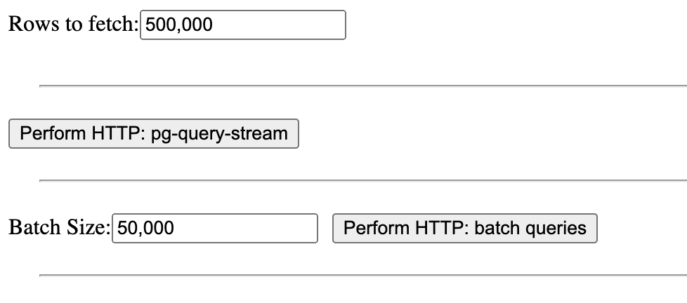
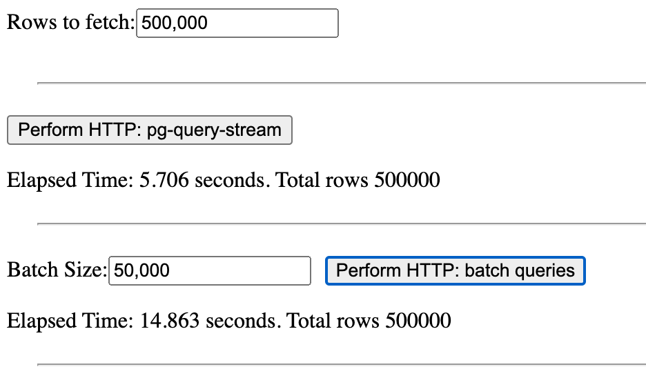
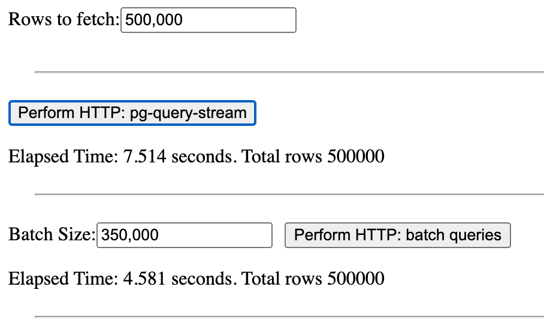

# Streaming PostgreSQL data with Fastify

The last years we have been surrounded by cool interactive data visualization.
These visualizations are powered by datasets that are stored in databases and made available through APIs.

Clients can then query the API and get the data they need to render the visualization.

But what happens when the dataset is huge?
And what if the query to access the data is **complex** and **slow**?

You may be used to add a "cool" loading animation to your visualization and wait for the data to be loaded
but this is not the best user experience.

So, we are going to see how to stream a huge amount of data from a PostgreSQL database to a Reactjs client!

## Build the Dataset

I will go fast here because this is not the main topic of this article and the code is available on [GitHub][repo].

We will create two tables that rappresent our huge dataset:

| Table | Rows | Description |
| --- | --- | --- |
| `desks` | 200,000 | 200 thousands desks in a building |
| `items` | 10,000,000 | 10 million items on the desks |

The query we are going to analyze is the following:

```sql
  WITH start_time AS (SELECT pg_sleep(1) AS start_time)
  SELECT items.id, desks.name, row_number() OVER (ORDER BY items.id) AS row_number
  FROM items
  INNER JOIN desks ON desks.id = items.desk_id
  CROSS JOIN start_time
```

It reads all the items and the desks they are on and returns the result with a row number.

Since the query is not too much slow, we need to slow it down to simulate a real-world scenario with multiple joins and aggregations.
The `pg_sleep(1)` forces PostgreSQL to wait for 1 second before returning the result.

Now we can start the PostgreSQL server with a quick Docker command:

```bash
docker run --rm -p 5432:5432 --name fastify-postgres -e POSTGRES_PASSWORD=postgres -d postgres:15-alpine
```

Finally, we can seed the database with the tables and the data with the [`node seed.js` script on GitHub][repo].
It will take few minutes to complete, but at the end we will have a huge dataset to play with!

## Build the API

We are going to use [Fastify](https://www.fastify.dev/) to build the API,
it has everything we need to build a fast and scalable API in no time 🎉

But, before starting to write the code we need to think about the API we want to build.
Since we want to return a huge amount of data, we can't run the query and return the result in one shot:
whatever server we use, it will run out of memory!

So we need to stream the result of the query to the client by using different techniques:

- **Batching**: we can run the query in batches and return the result in chunks
- **Streaming**: we can stream the result of the query to the client as soon as we get the data

The Batching approach can be implemented by using the `LIMIT` and `OFFSET` clauses of the SQL language.
So we don't need any external library to implement it.

The Streaming approach is more complex instead, but it is more efficient and it allows us to return the data as soon as we get it.
A quick Google search will show you that there are few libraries that can help us with this task:

- [`pg-cursor`](https://www.npmjs.com/package/pg-cursor)
- [`pg-query-stream`][pg-stream]

Both libraries are great but the `pg-query-stream` has a better API, so we are going to use it.

> **Note**  
> I tested both `pg-` libraries before noticing that `pg-query-stream` uses `pg-cursor` under the hood 😅
> The performance of the two libraries are the same, so we are going to discuss `pg-query-stream` only.

Now that we know what we need to do, we can start writing the code!

### Project Setup

We will create a quick project setup.
It is important to note that the code is not optimized for production use, in order to keep the code as simple as possible.

If you want to learn more about Fastify, you may found useful the [Fastify book](https://backend.cafe/fastify-v4-book)!

So, let's start creating a new project from scratch with the following commands:

```bash
# Create the project
mkdir fastify-postgres-high-volume
cd fastify-postgres-high-volume
npm init -y

# Install Fastify
npm install fastify @fastify/postgres

# Install the PostgreSQL driver and utilities
npm install pg pg-query-stream JSONStream
```

Create the `app.js` file with the following content:

```js
const fs = require('fs').promises

// Create the Fastify server
const app = require('fastify')({ logger: true })

// A simple route to serve the Reactjs application
app.get('/', async function serveUi (request, reply) {
  reply.type('text/html')
  return fs.readFile('./index.html')
})

// Register the PostgreSQL plugin to connect to the database
app.register(require('@fastify/postgres'), {
  host: 'localhost',
  port: 5432,
  database: 'postgres',
  user: 'postgres',
  password: 'postgres',
  max: 20
})

// Register some plugins to implement the API - we will see them later
app.register(require('./lib/batch'))
app.register(require('./lib/stream'))

// Start the server
app.listen({ port: 8080, host: '0.0.0.0' })
```

It is time to scaffold the `lib/batch.js` plugin:

```js
module.exports = async function (app, opts) {
  app.get('/api/batch', queryBatch)
}

async function queryBatch (request, reply) {
  const notImplemented = new Error('Not implemented')
  notImplemented.statusCode = 501
  throw notImplemented
}
```

Let's scaffold the `lib/stream.js` plugin too:

```js
module.exports = async function (app, opts) {
  app.get('/api/stream', queryStream)
}

async function queryStream (request, reply) {
  const notImplemented = new Error('Not implemented')
  notImplemented.statusCode = 501
  throw notImplemented
}
```

We are going to implement the two plugins in the next sections.

The last thing we need to do is to create the `index.html` file that will be served by the server.
I have created a simple Reactjs application that lives in a single HTML file, you can find it on [GitHub][react].
The code is not important for this article, so I will not discuss it here, moreover we need the API to be up and running to test the client, so we will explore it later.

At this point we can start the server with the following command:

```bash
node app.js
```

> 💡 Node.js Tip  
> If you are running Node.js 20 or newer, you can use the `node --watch app.js` flag to reload the server when the code changes!
> It doesn't require any external library and it is very useful during development.

Once the server is up and running, we can open the browser and navigate to `http://localhost:8080` and
we should see the `index.html` application!

We can now implement the API's business logic!


### Implementing the Batching Approach

The Batching approach is the most common to implement since it is used broadly in the industry to paginate the results of a query.
The idea is to run the query in batches and return the data chunks, so we need two inputs from the client:

- `limit`: the number of rows to return in each chunk
- `offset`: the number of rows to skip before returning the batch result

We can get these two values in the `request.query` object by adding a JSON schema to the route that validates the input:

```js
app.get('/api/batch', {
  schema: {
    query: {
      type: 'object',
      properties: {
        offset: { type: 'number', default: 0 },
        limit: { type: 'number', default: 50_000 }
      }
    }
  }
}, queryBatch)
```

The `queryBatch` implementation will look like this:

```js
async function queryBatch (request, reply) {
  // Get the input from the client
  const offset = request.query.offset
  const batchSize = request.query.limit

  // The slow query we want to run
  const slowQuery = `
    WITH start_time AS (SELECT pg_sleep(1) AS start_time)
    SELECT items.id, desks.name, row_number() OVER (ORDER BY items.id) AS row_number
    FROM items
    INNER JOIN desks ON desks.id = items.desk_id
    CROSS JOIN start_time

    OFFSET $1
    LIMIT $2;
  `

  // Run the query and return the result
  const result = await this.pg.query(slowQuery, [offset, batchSize])
  return result.rows
}
```

When the client calls the `/api/batch` route, the server will run the `slowQuery` and return the result.

The `this.pg` object is an Application Decorator injected by the `@fastify/postgres` plugin and it is a PostgreSQL pool!

We can now test the API by running the following command:

```bash
curl http://localhost:8080/api/batch?offset=0&limit=10000
```

The server should return the first 10.000 rows of the result of the `slowQuery`!
Note that the response will pop-up in the terminal after 1 second at least 🐌

### Implementing the Streaming Approach

The Streaming approach **could** more complex to implement, but thanks to the [`pg-query-stream`][pg-stream] library it is not ✨

The idea is to stream the result of the query to the client as soon as we get the data.
So we need to create a stream that reads the result of the query and pipe it to the client.
The input we need from the client is the `limit` only, because we are going to stream the result and we don't need to skip anything.

We can read the `limit` input from the `request.query` object by adding a JSON schema to the route that validates the input:

```js
app.get('/api/stream', {
  schema: {
    query: {
      type: 'object',
      properties: {
        limit: { type: 'number', default: 50_000 }
      }
    }
  }
}, queryStream)
```

Now we can implement the `queryStream` function:

```js
const QueryStream = require('pg-query-stream')
const JSONStream = require('JSONStream')

async function queryStream (request, reply) {
  // Get the PostgreSQL client from the pool
  const client = await this.pg.connect()

  // The slow query we want to run
  const slowQuery = `
    WITH start_time AS (SELECT pg_sleep(1) AS start_time)
    SELECT items.id, desks.name, row_number() OVER (ORDER BY items.id) AS row_number
    FROM items
    INNER JOIN desks ON desks.id = items.desk_id
    CROSS JOIN start_time

    LIMIT $1;
  `

  // Create a new stream that runs the query
  const query = new QueryStream(slowQuery, [request.query.limit], {
    highWaterMark: 500
  })

  // Run the query and return the stream
  const stream = client.query(query)
  stream.on('end', () => { client.release() })
  return stream.pipe(JSONStream.stringify())
}
```

Let's analyze the code:

1. We create a new PostgreSQL client by calling `this.pg.connect()` that returns an available `client` from the pool
2. We create a new `QueryStream` that will run the same `slowQuery` as the batch implementation except for the `OFFSET` clause
  - It is important to note that we need to set the `highWaterMark` option to read a good amount of rows from the database. The [default value is 16](https://nodejs.org/api/stream.html#streamgetdefaulthighwatermarkobjectmode) that is too low for our use case!
3. We create a new `stream` by calling `client.query(query)` that will execute the query
4. We must remember to listen for the `end` event of the `stream` to release the `client` back to the pool
5. We return the `stream` piped to a `JSONStream` that will convert the result to a JSON string. Fastify will automatically manage the stream and send the result to the client!

We can now test the API by running the following command:

```bash
curl http://localhost:8080/api/stream?limit=10000
```

The server should return the first 10.000 rows of the result of the `slowQuery`!

You should see the result being streamed to the terminal as soon as the server gets the data from the database!
There is no delay between the rows, so the client can start to render the data as soon as it gets it!
The pop-up effect is gone! 🚀

## Build the Client

Now that we have the API up and running, we can build the client to test the API and see the effect of the two approaches.
Since I like minimalism 🤣 and I don't want to spend too much time on the client, I will use the [Reactjs application][react] I have created before.

It is a simple application with the following features:

- An input to set globally how many rows we must fetch from the API calls
- A button to call the `/api/batch` route and show the time it takes to get the result
  - An input to set the maximum rows to get for each batch, we can't get all the rows in one shot or the server will run out of memory!
- A button to call the `/api/stream` route and show the time it takes to get the result

Here is a screenshot of the application:



Now, let's press the buttons and see what happens!

## Results

If we press the buttons with the default values, we will get the following results:



It must be noted that the results include the time it takes to parse the data in the browser.

Before analyzing the results, let's try to play with the inputs to see how the results change.

What happens if we increase the batch size to 350.000?



The batch approach is much more faster than before and it beats the streaming approach!

Let's analyze the results:

| Total Rows | Batch Size | Batch Result Time (sec) | Stream Result Time (sec) | Number of Batches |
| --- | --- | --- | --- | --- |
| 500,000 | 50,000 | ~14 | ~7 🥇 | 10
| 500,000 | 350,000 | ~5 🥇 | ~7 | 2
| 1,000,000 | 350,000 | ~8 🥇 | ~15 | 3
| 3,000,000 | 350,000 | ~30 🥈 | ~30 🥈 | 9
| 3,500,000 | 350,000 | ~36 | ~34 🥇 | 10
| 5,000,000 | 350,000 | ~63 | ~53 🥇 | 15

> Each test result is the best of 3 tests after refreshing the web page and clearing the cache.
> The Fastify server runs locally on a MacBook Pro 2019 and it is never restarted during the tests.

The results are very interesting!
The streaming approach is faster than the batch approach when the number of batches (calculated by `totalRows / batchSize`) is higher or equal to 10.

In fact, for every batch round trip, the batch approach needs to wait for the server to run the query and pay its execution time.
The streaming approach instead, runs the query only once!

This is because the streaming approach doesn't need to wait for the server to run the query and return the result, it just needs to wait for the database to run the query and send the result to the server.

## Summary

If you enjoyed this article, comment, share and follow me on [Twitter](https://twitter.com/ManuEomm)!

[repo]: https://github.com/Eomm/fastify-discord-bot-demo/tree/HEAD/bonus/postgres/
[react]: https://github.com/Eomm/fastify-discord-bot-demo/tree/HEAD/bonus/postgres/index.html
[pg-stream]: https://www.npmjs.com/package/pg-query-stream