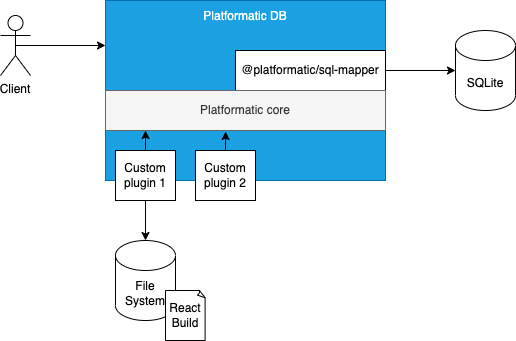
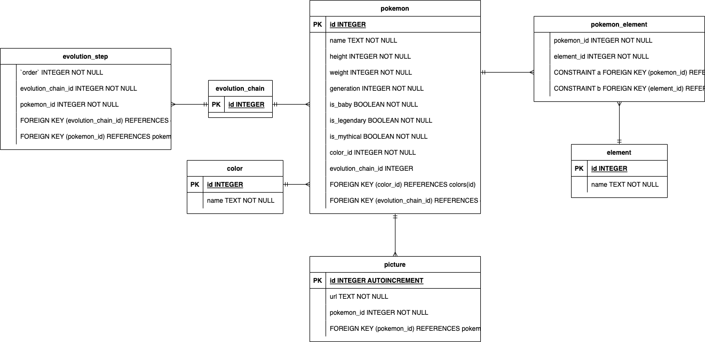
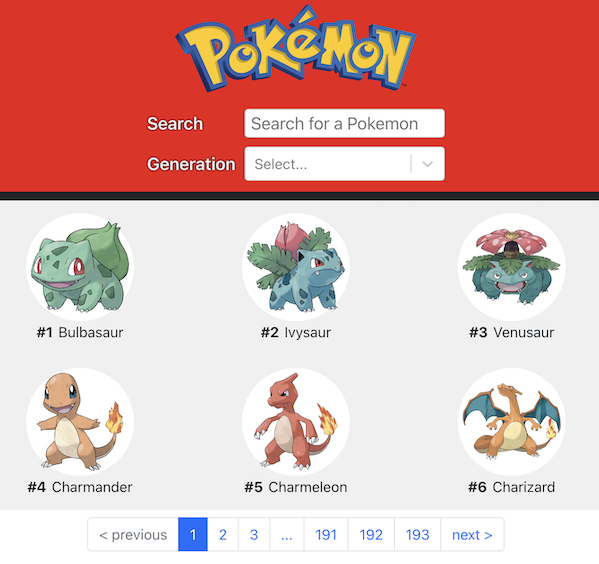
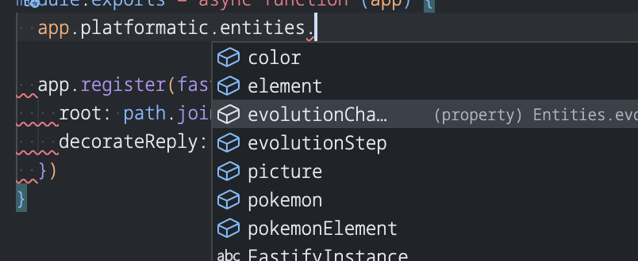

# How to build a Pokedex with Platformatic

Recently, [Matteo Collina](https://nodeland.dev/), one of Fastify's creators and much more, launched [Platformatic](https://platformatic.dev/): a _fast_ backend development platform.
Since it is built on top of Fastify, it claims to be a life changer, and I want to try it and write down my thoughts!

So, what are we going to build? A Pokedex!  

> A [Pokedex](https://pokemon.fandom.com/wiki/Pok%C3%A9dex) is a fictional device from the Pokemon franchise
> that is capable of showing information regarding the various species of the Pokémon universe.

Of course, I don't want to write a boring article, let's make it a bit more fun!  
Here are the requirements:

- The Pokemon database already exists. It will be our "legacy" system
- I want to build a React frontend. It will test Platformatic's "extensibility". Note that Platformatic is a "Backend" framework, but fastify can handle frontend too!
- The application must be read-only. I don't want to expose any API with `write` privileges.

The final application architecture will look like:



Now that we have the requirements let's start!


## Creating the Platformatic project

We can start by creating the Platformatic project.
I followed the [Plafromatic documentation](https://oss.platformatic.dev/docs/getting-started/quick-start-guide/#create-a-new-api-project)
that is well-written and helpful.

So, I'm going to recap what I did briefly.

### Installation

The installation requires Node.js >= v18.8.0, and then we can run one single command:

```bash
npm create platformatic@latest
```

Then, the installer will ask you some questions.  
Here is my complete output:

```sh
Need to install the following packages:
  create-platformatic@0.12.1
Ok to proceed? (y) y
 Hello, Manuel Spigolon welcome to Platformatic 0.12.1!
 Let's start by creating a new project.
? Which kind of project do you want to create? DB
? Where would you like to create your project? .
? Do you want to create default migrations? yes
? Do you want to create a plugin? yes
? Do you want to use TypeScript? no
[10:25:02] INFO: Configuration file platformatic.db.json successfully created.
[10:25:02] INFO: Environment file .env successfully created.
[10:25:02] INFO: Migrations folder migrations successfully created.
[10:25:02] INFO: Migration file 001.do.sql successfully created.
[10:25:02] INFO: Migration file 001.undo.sql successfully created.
[10:25:02] INFO: Plugin file created at plugin.js
? Do you want to run npm install? yes
✔ ...done!
? Do you want to apply migrations? no
? Do you want to generate types? no
[10:26:36] INFO: Configuration schema successfully created.
? Do you want to create the github action to deploy this application to Platformatic Cloud? yes
[10:26:40] INFO: Github action successfully created, please add PLATFORMATIC_API_KEY as repository secret.
 
All done! Please open the project directory and check the README.
```

After this setup, we have an empty project ready to be adapted to our needs.

### Database Preparation

The `migrations/` folder was created during the project generation.  
This folder will contain the database schema and the data that Platformatic will use to create the SQLite database.

Here must remove all the files and create:

- The `001.do.schema.sql` file that will contain the database schema.
- The `002.do.data.sql` file that will contain the database data.

These files represent our "legacy" system.

The following image shows the raw Entity-Relation schema for our Pokedex:



We must write down the SQL code into the `001.do.schema.sql` file.
It will be the first migration file to execute.

Then we need to fill the schema so that we will extract the data from [Poke API](https://pokeapi.co/docs/v2#pokemon).
I used the following GraphQL query to collect all the Pokemon data:

```gql
query gottaCatchThemAll {
  pokemon: pokemon_v2_pokemon {
    id
    name
    height
    weight
    types: pokemon_v2_pokemontypes {
      type: pokemon_v2_type {
        name
        id
      }
    }
    images: pokemon_v2_pokemonsprites {
      sprites
    }
    specy:pokemon_v2_pokemonspecy {
      generation_id
      is_baby
      is_legendary
      is_mythical
      color:pokemon_v2_pokemoncolor {
        name
        id
      }
      evolutions: pokemon_v2_evolutionchain {
        baby_trigger_item_id
        id
        chain: pokemon_v2_pokemonspecies {
          id
          order
        }
      }
    }
  }
}
```

Then, with a [simple magical Node.js script](https://github.com/Eomm/pokedex/blob/main/scripts/generatePokebase.js),
we can save the `INSERT` statements into a `002.do.data.sql` file.

At this point, we have the database schema and the data.  
Now we are ready to wire Platformatic with our custom database.  
To do so, I created some additional `scripts` in the `package.json`:

```
{
  "scripts": {
    "start": "platformatic db start",
    "db:migrations": "platformatic db migrations apply",
    "db:types": "platformatic db types"
  }
}
```

> I love this setup because it will execute the installed `platformatic` CLI
> and I must not remember complex commands

So, by running the `npm run db:migrations` command:

- it will create an SQLite database with our Pokemons!
- the `types/` folder is generated to help us during the development phase!

We are ready to execute `npm start` to spin up our server!  
If all is correctly working you will be able to open a browser at `http://localhost:3042/pokemon/6`
to see the most powerful Pokemon 🔥!


## Adding a User Interface to Platformatic

This website is **backend.cafe**, so I'm not going to annoy you explaining how I built the Pokedex UI,
I'm still improving my frontend skill set.
It is worth mentioning that the React.js application and the Platformatic auto-reload are nice and shiny during the implementation phase.

Here is a preview of what I have built so far:



This UI has some challenges for the backend too:

- Serve the website pages
- A very long list to show with pagination
- A search form
- A `<select>` input item with a list of the database's data

Let's solve it all!

### Serve a static website

To serve static files with Fastify, you need to use [`@fastify/static`](https://github.com/fastify/fastify-static) plugin.  
And I used it with Platformatic because all the Fastify's plugins are compatible!

As a Fastify user, doing it has been effortless. I created a `/static-website.js` file that does what I need:

```js
const path = require('path')
const fastifyStatic = require('@fastify/static')

/** @param {import('fastify').FastifyInstance} app */
module.exports = async function (app) {
  app.register(fastifyStatic, {
    root: path.join(__dirname, 'pokedex-ui/build'),
    decorateReply: false
  })
}
```

The code is quite straightforward but has one fabulous addition.  
The `jsdoc` comment before the `module.exports` statement enables a cool autocompletion feature adding your whole database!



This pattern works for TypeScript users and pure JavaScript developers too!

After implementing our custom code, we must integrate it into Platformatic, so we need to edit the core of our Platformatic application, the `platformatic.db.json` file.  
This [configuration file controls](https://oss.platformatic.dev/docs/next/reference/db/configuration) everything
on our application, such as:

- The HTTP server
- The additional plugins and integrations
- The different environments
- The authorizations
- The application metrics and monitoring
- ..and many other things

In our case, we need to add our `static-website.js` to the `plugins` section and turn the `dashboard` offline:

```json5
{
  // ... other Platformatic settings
  "dashboard": false,
  "plugin": [
    {
      "path": "static-website.js"
    }
  ]
}
```

By default, Platformatic serves a dashboard as the root endpoint `/`.  
It is insightful to explore all the endpoints Platformatic generated for us.  
In my case, I wanted to serve the Pokedex UI as the root path, so I had to turn it off. (Note there is a feature request [to customize the dashboard endpoint](https://github.com/platformatic/platformatic/issues/657))

### How to implement the pagination and the search form

Well... I don't have too much to say here because **it works out of the box**!  
To implement it, I need two queries:

- One to search a slice of the whole dataset
- One to count the whole dataset by using the same filters of the search query

Under the hood, Platformatic is using the [`@platformatic/sql-mapper`](https://oss.platformatic.dev/docs/reference/sql-mapper/introduction) plugin to generate a set of APIs from a database schema.
[Here, you can find a complete list](https://oss.platformatic.dev/docs/reference/sql-mapper/entities/api) of the generated endpoints. This plugin can generate what you need to implement the pagination and the search form without any extra configuration!

The queries are the following:

```gql
query searchPokemon($limit: LimitInt, $offset: Int, $name: String, $gen: [Int]) {
  pokemon(limit: $limit, offset: $offset, where: {name: {like: $name}, generation: { in: $gen } }) {
    id
    name
    picture { url }
    isLegendary
  }
}

query countSearchPokemon($name: String, $gen: [Int]) {
  countPokemon(where: {name: {like: $name}, generation: { in: $gen }}) {
    total
  }
}
```

As you can see, the only difference is that the first query manages the `limit` and `offset` parameters that are a standard de facto for every pagination.

Moreover, every generated endpoint has a [complete query system](https://oss.platformatic.dev/docs/reference/sql-mapper/entities/api#where-clause) to filter the data!

I enjoyed focusing only on my Pokedex UI, without needing to implement or change something in the backend.


### How to run a custom query

The `Generation` select item in the search box should list all the Pokemon's generations.
This query is too specific, and our database schema doesn't facilitate how Platformatic generates such a query. So we need to write a custom endpoint!

Since Platformatic generates REST and GraphQL endpoints by default, we need to choose if we want to implement the custom endpoint as REST or GQL or both: it is up to us.

I will go for the GQL one because my UI relies on GraphQL to communicate with the backend.

The operation consists in two steps:

1. Extend the GQL Schema by declaring the custom Query
2. Implment the new Query resolver

If you don't know GQL and these steps are not clear, I think that reading [these articles](https://backend.cafe/series/mercurius)
will help you to introduce yourself to GraphQL.

```js
/** @param {import('fastify').FastifyInstance} app */
module.exports = async function (app) {
  // 1. Extend the GQL Schema
  app.graphql.extendSchema(`
    extend type Query {
      generations: [Int]
    }
  `)

  // 2. Implement the resolver
  app.graphql.defineResolvers({
    Query: {
      generations: async function (source, args, context, info) {
        const sql = app.platformatic.sql('SELECT DISTINCT generation FROM Pokemon ORDER BY generation ASC')
        const generations = await app.platformatic.db.query(sql)
        return generations.map(g => g.generation)
      }
    }
  })
}
```

The handler runs a raw SQL query and returns the results - nice and easy.
As documented, the `app.platformatic.sql` decorator returns the [`@database`](https://www.atdatabases.org/)
instance already configured a ready to be used. This module provides a comprehensive set of features to query your database, protecting it from SQL injections.

### How to expose read-only endpoints

By default, Platformatic doesn't perform any authorization check, but we can configure it in the`platformatic.db.json` file. 
Adding a simple `authorization: {}` property will turn authentication on.  
This configuration will block everything because this setup is all blocked by default now.

Since we want to provide read access only, we need to list all the entities we want to grant read access.

Here is an example of the output configuration:

```json5
{
  // .. other configuration properties
  "authorization": {
    "rules": [
      {
        "role": "anonymous",
        "entity": "pokemon",
        "find": true,
        "save": false,
        "delete": false
      },
      {
        "role": "anonymous",
        "entity": "pokemonElement",
        "find": true,
        "save": false,
        "delete": false
      },
      {
        "role": "anonymous",
        "entity": "picture",
        "find": true,
        "save": false,
        "delete": false
      }
      // .. repeat for every database entity
      // until this new shortcut will be released 🎉
      // https://github.com/platformatic/platformatic/issues/658
    ]
  }
}
```

With the previous setup, we are granting to any `anonymous` users the `find` operation while blocking the `save` (aka `insert` and `update`) and the `delete` ones.
This example is simple with `true` and `false` values, but every rule item may contain more complex checks as [broadly documented](https://oss.platformatic.dev/docs/reference/db/authorization/rules).

Restarting our Platformatic service with the new configuration, will block any `DELETE` or `PATCH` calls to our endpoints 🛡️

### How to deploy it?

This step is always a pain for me because I need to search for a small and free infrastructure where I can publish my experiments and skill up - possibly without providing my credit card!

If you read the installation process output carefully, there was this option:

> Do you want to create the github action to deploy this application to Platformatic Cloud? yes

So, the deployment to the [Platformatic beta environment](https://platformatic.cloud/) took me these steps:

- Login to [https://platformatic.cloud/](https://platformatic.cloud/)
- Generate an API key
- Copy and paste the API key to the GitHub repository's secrets
- Done!

Nice and shiny! So, by opening a pull request, I get a [clear message](https://github.com/Eomm/pokedex/pull/2#issuecomment-1373335670)
that link me [my live application](https://sable-happy-alluring-shirt.deploy.space/)!  
I never try a smoother process than this one! 👏


## Summary

After building this small project, I think Platformatic is not just an ORM as it may seem but an enhanced version of Fastify.  
It implements a lot of good practices and boring stuff that enable us to spin up a fastify instance with:

- A solid database interface and upgrade process
- A good authentication and authorization
- Application already wired to gather metric and measurements
- Easy to apply CORS settings
- ..all this is extendible with custom Fastify plugins, so all you already did can still be used

Of course, we did not cover all these topics in this article but I hope you would like to try them out.
The last important thing to mention is that Platformatic has not yet reached the v1 release. It is still under development and adds many new cool features at every release.  
I'm curious to know what the `v1` version will include!

As always, you can find the source code at [https://github.com/Eomm/pokedex](https://github.com/Eomm/pokedex).  
If you enjoyed this article, comment, share, and follow me on [Twitter @ManuEomm](https://twitter.com/ManuEomm)!
