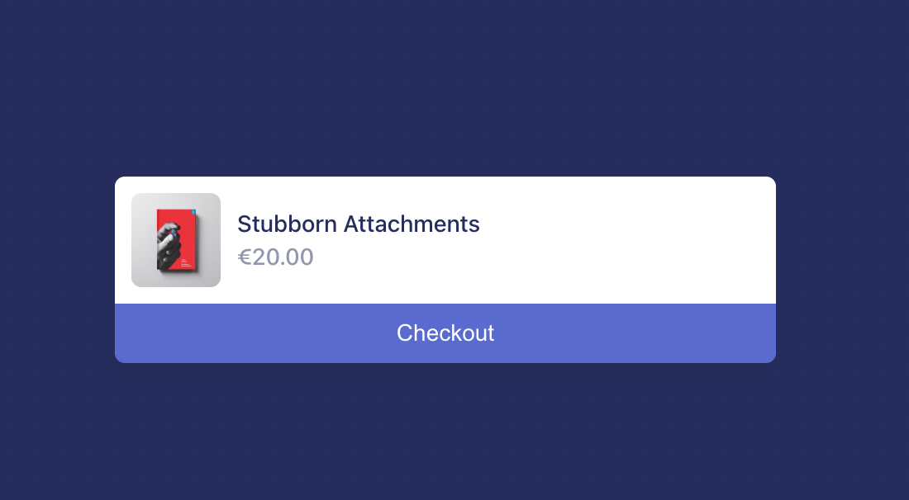

# Integrate Stripe with Fastify

by *[Manuel Spigolon](https://twitter.com/ManuEomm)*

In this article, we will understand how to use Fastify and Stripe as a payment gateway! So, let's start!

## Who to configure Stripe?

Stripe is a payment gateway that allows you to accept payments on your website.
Integrating Stripe with Fastify is easy, but you need some configuration before starting with the code.

First, you need to create a [Stripe account](https://dashboard.stripe.com/register) and in a few seconds, you will get access to the Stripe test environment.

After that, you need to:

1) Copy paste the `Secret key` from the home page of your Stripe account.


2) Create a test product accessing the `Products` tab in the Stripe dashboard.


3) Finally, get the `price id` from the product detail page.


Great! Now you can start using Stripe with Fastify.

## What will Fastify do?

What we are going to do is to create a simple payment gateway that will accept payments with Stripe.
The flow will be:

    0. User sees our product web page.
    1. User clicks on the button to pay.
    2. Fastify creates a Stripe session and redirects the user to the Stripe checkout page.
    3. Stripe redirects the user to the callback URL.
    4. Fastify receives the payment and sends a response to the user.

Since we are not focusing on the implementation of web pages, we will use the Stripe  
test pages.
All the pages are stored in this GitHub repository: [`Eomm/fastify-discord-bot-demo`](https://github.com/Eomm/fastify-discord-bot-demo/tree/master/bonus/stripe-integration) or in the [Stripe documentation](https://stripe.com/docs/checkout/quickstart?lang=node).

### Project installation

To create an empty project, we need to create a new folder and run the following commands:

```bash
mkdir my-fastify-app-stripe
cd my-fastify-app-stripe
npm init --yes
```

Now we can install all the dependencies we need:

- `fastify`: our favourite framework for building web applications.
- `stripe`: the official Stripe SDK.
- `@fastify/static`: the plugin that allows us to serve static files.
- `@fastify/formbody`: the plugin that allows us to parse the `x-www-form-urlencoded` body of the request.
- `@fastify/env`: the plugin that allows us to configure our application from the environment variables.

Create a `.env` file where you can configure the following variables:

```
NODE_ENV=dev
PORT=3000
STRIPE_PRIVATE_KEY=--paste-stripe-private-key-here--
BASE_URL=http://localhost:3000
HOST=0.0.0.0
```

Finally, we must copy the test web pages into a new `public/` folder. You should have downloaded those pages in the previous section.

### Project configuration

We are ready to create a new `app.js` file to start writing our application.
Our first steps are:

- Configure the `@fastify/static` plugin to serve the `public/` web pages.
- Configure the `@fastify/env` plugin to read the `.env` file, and the `schema` option will warn us if we are missing some environment variables.

```js
'use strict'

const path = require('path')

const fastify = require('fastify')
const fastifyStatic = require('@fastify/static')
const env = require('@fastify/env')

async function buildApp () {
  const app = fastify({
    logger: true
  })

  app.register(fastifyStatic, {
    root: path.join(__dirname, '/public')
  })

  await app.register(env, {
    dotenv: true,
    schema: {
      type: 'object',
      required: ['PORT', 'STRIPE_PRIVATE_KEY'],
      properties: {
        NODE_ENV: { type: 'string' },
        PORT: { type: 'integer' },
        STRIPE_PRIVATE_KEY: { type: 'string' },
        HOST: { type: 'string', default: 'localhost' },
        BASE_URL: { type: 'string', default: 'http://localhost:3000' }
      }
    }
  })

  return app
}

async function run () {
  const app = await buildApp()
  app.listen({
    port: app.config.PORT,
    host: app.config.HOST
  })
}

run()
```

Now, running the `node app.js` command will start the application, and if you open a browser at `http://localhost:3000/` you should see the product page.



Well done so far!

### Stripe integration

Right now, clicking on the button to pay will redirect the user to the Stripe checkout page, but it won't work because we don't have integrated Stripe yet.

So, let's create a new `stripe-integration.js` file with the following code:

```js
'use strict'

const stripe = require('stripe')

module.exports = async function plugin (app, opts) {
  const stripeClient = stripe(app.config.STRIPE_PRIVATE_KEY)

  app.register(require('@fastify/formbody'))

  app.post('/create-checkout-session', async (request, reply) => {
    const session = await stripeClient.checkout.sessions.create({
      line_items: [
        {
          // Provide the exact Price ID
          price: 'price_1LRC97CHE57DZYK7ay4z2eGw',
          quantity: 1
        }
      ],
      mode: 'payment',
      success_url: `${app.config.BASE_URL}/success?id=${Math.random()}`,
      cancel_url: `${app.config.BASE_URL}/cancel?id=${Math.random()}`
    })

    return reply.redirect(303, session.url)
  })

  app.get('/success', async (request, reply) => {
    request.log.info('success callback from id %s', request.query.id)
    return reply.sendFile('success.html')
  })

  app.get('/cancel', async (request, reply) => {
    request.log.info('cancel callback from id %s', request.query.id)
    return reply.sendFile('cancel.html')
  })
}
```

This file is a Fastify plugin that manages the Stripe integration.
First, it instantiates the Stripe client with the `STRIPE_PRIVATE_KEY` environment variable.
Then, it registers the `/create-checkout-session` route that will create a new checkout session.
During the creation of the session, you will be able to control the price and the quantity of the product.
Now, for the test purposes, we copied and pasted the `price` ID we generated in the Stripe dashboard, but of course, you can dynamically load it based on the user input.

As explained in the `What will do Fastify?` Section, we have the `success` and `cancel` endpoints that will be reached the Stripe checkout page complete the payment.
In this case, we are just adding a random ID to the query string to mock that we can identify the callbacks to update some data.

The `sendFile` method will send the file located in the `public/` folder and will show a feedback message to the users to let they know that they will receive the goodies they just payed.

## Summary

Congratulations! You have completed the Fastify with Stripe tutorial!
Now you can start improving this basic scaffolding to integrate your e-commerce
with Stripe through Fastify.

The source code is available at [`stripe-integration`](https://github.com/Eomm/fastify-discord-bot-demo/tree/master/bonus/stripe-integration)

Remember to follow me on Twitter [@Eomm](https://twitter.com/Eomm) to get more content!
See you soon for the next article!
