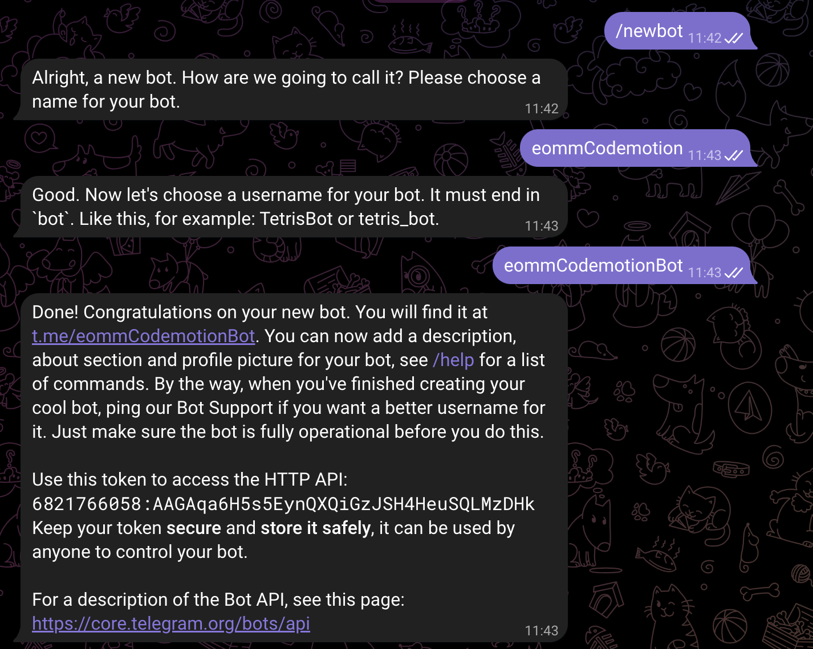

# Create a Telegram Bot with Fastify from Scratch

In today's digital landscape, chatbots have become a ubiquitous part of our online interactions.
These versatile and intelligent programs help automate tasks, answer queries, and provide a seamless conversational experience.

One popular platform for developing chatbots is Telegram, known for its user-friendly interface and robust features. If you've ever wondered how to create your very own Telegram bot, you're in the right place!

Today, we will build a Telegram bot from the ground up using the Fastify framework. Fastify is a high-performance web framework for Node.js, making it an excellent choice for developing web applications and APIs. By the end of this blog post, you'll have a fully functional Telegram bot!

So, let's dive into the process of creating your own Telegram bot with Fastify!

## Setting up the Project

Our journey begins by setting up the foundation for our Telegram bot project. We've chosen to leverage [Platformatic], a powerful tool that accelerates project setup, allowing you to hit the ground running. With just a few simple commands, Platformatic creates a complete Fastify application, preconfigured and ready to use, seamlessly connected to the most famous RDBMS Databases (we will use SQLite). This not only saves you time but also provides a solid base for your Telegram bot project.

To get started, run the following command:

```bash
npm create -y platformatic@1
```

You will be prompted with a few questions about your project. Here are the answers we recommend:

```bash
 Hello Eomm, welcome to Platformatic 1.2.0!
 Let's start by creating a new project.
? Which kind of project do you want to create? DB
? Where would you like to create your project? my-telegram-bot
? What database do you want to use? SQLite
? Do you want to use the connection string "sqlite://./db.sqlite"? Confirm
? What port do you want to use? 3042
? Do you want to run npm install? yes
? Do you want to create default migrations? yes
? Do you want to apply migrations? yes
? Do you want to create a plugin? yes
? Do you want to use TypeScript? no
? Do you want to create the github action to deploy this application to Platformatic Cloud? yes
? Do you want to enable PR Previews in your application? no
```

Now, if we move to the `my-telegram-bot` folder, we can start the server with the following command:

```bash
npm start
```

You can access the application at `http://localhost:3042`, where you'll find the default Platformatic welcome page.

Exploring the project structure, we can see that Platformatic has created many files and folders for us.
Here is the most important ones:

- `platformatic.db.json`: the configuration file of the project. It is the main file that Platformatic uses to understand how to build the project. You will recognize many Fastify's standard options here.
- `migrations/`: the folder that contains the database migrations. The cool thing is that based on the database schema, Platformatic will provide to the application an object to interact with the database!
- `plugins/`: the folder that contains the Fastify plugins. Platformatic will automatically register them for us!
- `routes/`: the folder that contains custom Fastify routes. Platformatic will automatically register them for us!
- `.env`: the file that contains the environment variables. Platformatic will automatically load them for us! _(if we name them with the `PLT_` prefix)_

I like to say that if you know Fastify, you know Platformatic! Platformatic is _"just"_ Fastify with batteries included!
Now that we have a solid foundation for our project, we can start building our Telegram bot!


## Implementing the Telegram bot

Our first step on this Telegram bot creation journey involves setting up our bot on the Telegram platform.
To achieve this, we'll interact with [@BotFather](https://t.me/BotFather), a official Telegram bot that assists in creating and managing other bots.

- Start a chat with [@BotFather](https://t.me/BotFather)
- Execute the `/newbot` command
- Choose a name for your bot (e.g. `My Bot`)
- Choose a username for your bot (e.g. `eommDemoBot`)

Once you've completed these steps, you'll have obtained the token for your bot:




Now, integrate this token into your project by adding the following line to the `.env` file:

```bash
PLT_TELEGRAM_BOT_TOKEN=PUT_HERE_YOUR_TOKEN
```


To simplify the integration, we'll use the [`@eomm/fastify-telegram`][f-telegram] package. You can install this package with the following command: `npm i @eomm/fastify-telegram`. 

Next, rename the `plugins/example.js` file to `plugins/telegram.js` and add the provided JavaScript code. This code configures the `@eomm/fastify-telegram` package and sets up your bot to respond to messages:

```js
const fastifyTelegram = require('@eomm/fastify-telegram')

/** @param {import('fastify').FastifyInstance} app */
module.exports = async function telegramBotPlugin (app, opts) {
  await app.register(fastifyTelegram, {
    botToken: app.platformatic.configManager.env.PLT_TELEGRAM_BOT_TOKEN,
    decoratorBotName: 'bot',
    waitForHealthPolling: 2_000,
    onUnhandledError: async (err, ctx) => {
      app.log.error(err, `Ooops, encountered an error for "${ctx.updateType}"`)
      await ctx.reply('🙈 Ooops, something went wrong')
    }
  })

  app.bot.on('text', async (ctx) => {
    await ctx.reply('Hello World!')
  })
}
```

Let's analyze the code:

1. We export a standard Fastify plugin. Platformatic will automatically register it for us! Note the JSDOC comment that loads the type definition of the Fastify instance and allows us to use the `app` object with autocompletion.
1. We register the `fastifyTelegram` plugin as a normal Fastify plugin.
1. We pass the `botToken` option to the `fastifyTelegram` plugin using the Platformatic's `configManager` utility. This option is required and is the token we got from the `BotFather`.
1. We pass the `decoratorBotName` option to customize the name of the decorator that will be injected into the Fastify application.
1. We pass the `onUnhandledError` option to the `fastifyTelegram` plugin. This option is optional and is a function that will be called when an unhandled error occurs on our Bot logic. The plugin will automatically catch the error and call this function to avoid a server crash.
1. Finally, we register a listener for the `text` event of the `app.bot`. This object is a [Telegraf][telegraf] bot instance that is automatically injected into the Fastify application by the `fastifyTelegram` plugin. You can customize the bot by adding listeners to the events you want to handle.

Now we can start the server with `npm start` and if we open a new chat with our bot, we should see the `Hello World!` message!

Under the hood, the `@eomm/fastify-telegram` plugin initiates a [long polling](https://github.com/pytopia/project-nashenas-telegram-bot/blob/main/Long%20Polling%20vs.%20Webhook.md) process against the Telegram API, waiting for new messages from the Telegram servers.


## Registering Users

Now that we have a working Telegram bot, we can start implementing the business logic. Registering users is an essential part of this process. To achieve this, we will use Platformatic's utilities to interact with the database.

You'll need to rewrite the `migrations/001.do.sql` file with the provided SQL schema. This migration will create a `users` table, allowing you to store user information:

```sql
CREATE TABLE users (
  id TEXT PRIMARY KEY,
  chat_id TEXT UNIQUE NOT NULL,
  full_name TEXT NOT NULL,
  username TEXT NOT NULL,
  lang CHAR(2) NOT NULL DEFAULT 'en',
  created_at TIMESTAMP DEFAULT CURRENT_TIMESTAMP
);
```

This migration will create a `users` table automatically for us, just remember to delete the `db.sqlite` file before starting the server again.

Since the `routes/` folder contains the business logic of our application, we can create a new file called `routes/telegram-bot.js` and add the following code:

```js
/// <reference path="../global.d.ts" />
'use strict'

/** @param {import('fastify').FastifyInstance} fastify */
module.exports = async function (app, opts) {
  app.bot.use(async function upsertUser (ctx, next) {
    const userId = ctx.update.message?.from.id || ctx.update.callback_query?.from.id
    const chatId = ctx.update.message?.chat.id || ctx.update.callback_query?.message?.chat.id

    const [user] = await app.platformatic.entities.user.find({
      where: { id: { eq: userId } }
    })

    if (user) {
      ctx.user = user
    } else {
      app.log.info('Creating new user', ctx.update.message.from)

      const fullName = ctx.update.message.from.first_name + (ctx.update.message.from.last_name ? ` ${ctx.update.message.from.last_name}` : '')
      const [newUser] = await app.platformatic.entities.user.insert({
        fields: ['id', 'fullName', 'username', 'lang'],
        inputs: [
          {
            id: userId,
            chatId,
            fullName,
            username: ctx.update.message.from.username || userId,
            lang: ctx.update.message.from.language_code
          }
        ]
      })

      ctx.user = newUser
    }

    return next()
  })

  app.bot.on('text', async (ctx) => {
    await ctx.reply(`Hello ${ctx.user.fullName}!`)
  })
}
```

Let's analyze the plugin logic:

1. We don't register any new routes, but we use the `app.bot` decorator to implement the business logic.
1. We use the `app.bot.use` method to register a middleware that will be executed for every message received from Telegram. This middleware will extract the `userId` and the `chatId` from the update and will search for the user in the database.
1. If the user exists, we will set the `ctx.user` property to the user object, enhancing the Telegraf's `ctx` object with the user information.
1. If the user doesn't exist, we will create a new user in the database and set the `ctx.user` property to the new user object.
1. Finally, we register another listener for the `text` event of the `app.bot` and we use the `ctx.user` property to customize the reply message.

With this logic in place, you can start the server with `npm start`. When you open a chat with your bot, you'll receive a personalized `Hello {name}!` message.


## Summary

Congratulations! 🎉 You've just embarked on an exciting journey to create your very own Telegram bot from scratch.
In this article, we've harnessed the power of [Platformatic] to expedite our project setup, establishing a solid foundation for our bot.  
We've also delved into the process of generating a basic Telegram bot that responds to user messages and interacts with the database to register users.  
Now the possibilities are endless, and your Telegram bot can be customized to suit your unique needs.  

I build two complete Telegram bots with Platformatic if you want to see more examples:

- [`telegram-bot-questions`](https://github.com/Eomm/telegram-bot-questions): a bot to ask questions to your team mates. It integrates with Google Sheets to store the answers and has a step by step guide to implement the bot.
- [`telegram-bot-give-away`](https://github.com/Eomm/telegram-bot-give-away): a bot to organize a custom give away.

The world of chatbot development is at your fingertips, and with each step, you're one step closer to mastering it. Happy coding! 🤖💬

If you enjoyed this article, comment, share and follow me on [Twitter](https://twitter.com/ManuEomm)!


[Platformatic]: https://platformatic.dev/
[f-telegram]: https://npmjs.com/package/@eomm/fastify-telegram
[telegraf]: https://telegrafjs.org/
