# Handling HTTP Timeouts in Fastify

The hardest part of my job is thinking like a malicious user... or like an AI in its early stages of writing HTTP servers!  
This exercise is not easy because I love my clients' HTTP requests, and I'm sure they love my server!  
But that is not always the case... for this reason, we must be prepared to handle unexpected situations.

In this article, we will explore all the options available in Fastify to handle timeouts!  
A poorly implemented client or a malicious user could kill your server if we are not careful!

## How many timeouts do I need?

Before listing all the timeout options available in Fastify, let's take a moment
to understand the HTTP request lifecycle and identify where we need to set timeouts.

In the following diagram, we can see a simplified HTTP request lifecycle that includes the most important steps:

1. Establishing a TCP connection to create a socket.
2. TLS Handshake (if using HTTPS).
3. At this stage, the socket is open, and the server is waiting for the client to send the HTTP request as the protocol requires.
4. The server receives the request and processes it.
5. The server sends the response to the client.
6. The server either closes the connection or keeps it alive for future requests using the same socket.

```mermaid
sequenceDiagram
    participant Client
    participant Server

    Note over Client,Server: 1️⃣ Establishing TCP Connection
    %% Client->>Server: SYN (TCP Handshake)
    %% Server->>Client: SYN-ACK
    %% Client->>Server: ACK (Connection Established)

    %% alt 🔐 HTTPS Connection
        Note over Client,Server: 2️⃣ TLS Handshake (if 🔐 HTTPS)
        %% Client->>Server: Client Hello (Cipher Suites, TLS Version)
        %% Server->>Client: Server Hello (Certificate)
        %% Client->>Server: Key Exchange
        %% Server->>Client: Secure Connection Established
    %% end

    Note over Client,Server: 3️⃣ Sending HTTP Request
    Client->>Server: Send Request Headers
    Note over Server: ⏰ headersTimeout starts
    Server->>Client: ACK (Headers Received)
    Client->>Server: Send Request Body
    Note over Server: ⏰ requestTimeout starts
    Server->>Client: ACK (Body Received)

    Note over Server: 4️⃣ Processing the Request

    Note over Client,Server: 5️⃣ Sending the Response
    Server->>Client: Send Response Headers
    Server->>Client: Send Response Body

    Note over Server: ⏰ connectionTimeout starts

    Note over Client,Server: 6️⃣ Closing or Keeping Connection Alive
    alt Connection: close
        Server->>Client: Send Connection: close
        Server->>Client: Close Connection
    else Connection: keep-alive
        Server->>Client: Keep Connection Open
        Note over Server: ⏰ keepAliveTimeout starts
        Server->>Client: Close Connection
        %% alt No New Request Within keepAliveTimeout
        %%     Server->>Client: Close Connection
        %% else New Request Arrives
        %%     Client->>Server: Send New Request (Reusing Connection)
        %%     Note over Server: Reset keepAliveTimeout
        %% end
    end
```



In the diagram, the timeouts are represented with a clock icon ⏰.  
So, let's review them all _(note that the default values are Fastify defaults, not the Node.js ones)_:

| Timeout Setting                     | Description                                                                                                                                                                                                                                                                                  |
| ----------------------------------- | -------------------------------------------------------------------------------------------------------------------------------------------------------------------------------------------------------------------------------------------------------------------------------------------- |
| `headersTimeout`                    | Specifies the number of milliseconds to wait for the complete HTTP headers to be received. If the headers are not received within this period, the connection is terminated. [Default: `no-limit`](https://nodejs.org/api/http.html#serverheaderstimeout)                                    |
| `requestTimeout`                    | Defines the maximum duration, in milliseconds, to wait for the entire request from the client. If the request body isn't fully received within this time frame, the connection is closed. [Default: `no-limit`](https://fastify.dev/docs/latest/Reference/Server/#requesttimeout).           |
| `connectionTimeout` (aka `timeout`) | Sets the socket inactivity timeout in milliseconds. If there's no activity on the socket for the specified duration, the server closes the connection. [Default: `no-limit`](https://fastify.dev/docs/latest/Reference/Server/#connectiontimeout)                                            |
| `keepAliveTimeout`                  | Determines the time, in milliseconds, to wait for additional requests on a persistent connection (keep-alive). If no new request is received within this period, the server closes the connection. [Default: 72 seconds](https://fastify.dev/docs/latest/Reference/Server/#keepalivetimeout) |
| `connectionsCheckingInterval`       | Sets the interval value, in milliseconds, to check for request and headers timeout in incomplete requests. [Default: 30,000](https://nodejs.org/api/http.html#httpcreateserveroptions-requestlistener)                                                                                       |

Wow, that's a lot of timeouts! But why do we need all of them?

All these timeouts are crucial to ensuring that the server can handle incoming requests efficiently and prevent resource exhaustion.
Otherwise, a malicious user could send a request with a large payload and keep the connection open indefinitely,
causing the server to run out of memory or [file descriptors](https://en.wikipedia.org/wiki/File_descriptor)!

For example, `headersTimeout` ensures that the server doesn't wait indefinitely for the client to send the headers.  
This option helps prevent the [Slowloris attack](https://www.cloudflare.com/it-it/learning/ddos/ddos-attack-tools/slowloris/),
where an attacker sends headers very slowly to keep the connection open and exhaust server resources.

Now that we understand timeouts and their importance, let's see how to set them up in Fastify.

## Setting Up Timeouts in Fastify

To configure timeouts in Fastify, we must pass the options when creating the Fastify instance.  
Here's a **TL;DR** example:

```javascript
import fastify from "fastify";

const app = fastify({
  // 1 minute: this timeout runs while the server is processing the request, so it depends on the business logic
  connectionTimeout: 60_000,

  // 5 minutes: consider using a higher value for large payloads such as file uploads or slow connections
  requestTimeout: 300_000,

  // 5 seconds: this timeout runs while the server is waiting for a new request on the same socket
  keepAliveTimeout: 5_000,

  http: {
    // 30 seconds: the client has 30 seconds to send the headers
    headersTimeout: 30_000,
  },
});
```

Now, let's test the timeouts!  
I created a simple Fastify v5 server and a client to test the timeouts.  
For the sake of simplicity, the code can be found on [GitHub][repo] and is not included in this article.

## Testing Timeouts

If you have downloaded and installed the code from the [GitHub repository][repo],
we can run the server with Node.js v20+ and the following command and we can set the timeouts
via optional arguments:

```bash
# To start the server
node server.js --connectionTimeout 10000 \
  --requestTimeout 20000 \
  --keepAliveTimeout 5000 \
  --headersTimeout 30000 \
  --handlerTimeout 5000 \
  --connectionsCheckingInterval 10000
```

Then, we can run the client with the following command, where we can set the payload and header rate:

- `--headerRate`: we send a header every `headerRate` milliseconds
- `--payloadRate`: we send a byte every `payloadRate` milliseconds
- `--keepAlive`: if set, the client will keep the connection alive but will not send any new request

```bash
# To start the client
node low-level-client.js --headerRate 1000 \
  --payloadRate 1000
```

Cool! Now we can test the timeouts by running a simple command!

### Test the `headersTimeout`

Straight into the point: let's test the `headersTimeout` by sending a request with a very slow header rate.

```bash
# Set the header timeout to half a second
node server.js --headersTimeout 500

# Set the header rate to 1 second
node low-level-client.js --headerRate 1000
```

The expected output is a timeout error, because the server will wait for 500 milliseconds to collect all the headers,
but the client will send one header every second.

But, if we run those commands, we will see that the server will not throw any error 😱!

```bash
➜ node low-level-client.js --headerRate 1000
Connected to server
Sent Header: Host: localhost
Sent Header: User-Agent: Slow-Client
Sent Header: Accept: application/json
Sent Header: Content-Type: application/json
Sent Header: Content-Length: 83
Sent Header: Connection: keep-alive
Finished sending headers. Now sending body...
{"message":"Hello, this is a slow request!","timestamp":"2025-03-30T14:02:08.156Z"}

Received response: HTTP/1.1 200 OK
content-type: application/json; charset=utf-8
content-length: 17
Date: Sun, 30 Mar 2025 14:02:22 GMT
Connection: keep-alive
Keep-Alive: timeout=72

{"hello":"world"}
Disconnected from server after 14338 ms
```

The reason is that Node.js does not check the timeouts so frequently.
Actually the default `connectionsCheckingInterval` configuration is set to 30 seconds,
so the server will check the timeouts every 30 seconds.

This makes sense, because checking all the sockets every few millisecond would be a waste of CPU resources.
As always, we developers need to find a balance between performance and security.

So, for the sake of this article, let's set the `connectionsCheckingInterval` to 100 milliseconds
in order to appreciate the timeouts in real time, or if you would like to see a real Slowloris attack in action
set the `headerRate` to 60 seconds!

```bash
node server.js --headersTimeout 500 \
  --connectionsCheckingInterval 1000

node low-level-client.js --headerRate 2000
```

Cool! Now we can see the timeout in action:

```bash
Connected to server
Sent Header: Host: localhost
Received response: HTTP/1.1 408 Request Timeout
Content-Length: 71
Content-Type: application/json

{"error":"Request Timeout","message":"Client Timeout","statusCode":408}
Disconnected from server after 549 ms
```

### Test result

Now, we can run a lot of tests with different timeouts and payloads to see how the server behaves.
Here is a summary of the tests I ran _(considering the `connectionsCheckingInterval` set to 100 milliseconds)_:

| Test                  | Client Args                   | Server Args                                        | Result                                                                                                                                                       |
| --------------------- | ----------------------------- | -------------------------------------------------- | ------------------------------------------------------------------------------------------------------------------------------------------------------------ |
| Slow Headers          | `--headerRate 1000`           | `--headersTimeout 500`                             | Timeout Error: because the server will wait for 500ms to receive the headers, but the client will send one header every second.                              |
| Slow Payload          | `--payloadRate 1000`          | `--requestTimeout 5000`                            | Timeout Error: because the server will wait for 5 seconds to receive the payload, but the client will send one byte every second.                            |
| Keep-Alive Connection | `--payloadRate 1 --keepAlive` | `--keepAliveTimeout 4000`                          | After completing the request, the socker will be ended by the server after 4 seconds.                                                                        |
| Slow Server handler   | `--headerRate 1`              | `--connectionTimeout 10000 --handlerTimeout 60000` | Timeout Error: because the server will wait for 10 seconds to process the whole request, but the server handler will take 60 seconds to process the request. |

Now we can see that the server is able to handle the timeouts correctly and
the client is able to receive the timeout errors.

Use those scripts to test the timeouts in your own environment and see how they behave.

## Summary

In this article, we explored the different timeouts available in Fastify and how to configure them.  
We also tested them with a simple Fastify server and a custom socket.  
We learned that timeouts are essential for preventing resource exhaustion and ensuring that  
the server efficiently handles incoming requests.

Keep in mind that every application is different, but we should never forget to set timeouts!

If you enjoyed this article, you might like [_"Accelerating Server-Side Development with Fastify"_](https://backend.cafe/the-fastify-book-is-out).  
Comment, share, and follow me on [X/Twitter](https://twitter.com/ManuEomm)!

[repo]: https://github.com/Eomm/blog-posts/tree/HEAD/bonus/timeouts
