# Timeouts

The hardest part of my job is thinking like a malicious user... or like an AI in its early stages of writing HTTP servers!
This exercise is not easy, because I love my clients' HTTP requests and I'm sure they love my server!
But it is not always the case.. for this reason, we must be prepared to handle unexpected situations.

In this article we will see all the options available in Fastify to handle timeouts!
A bad client implementation, or a malicious user, could kill your server if we are not careful!

## Why so many timeouts?

Fastify exposes all the Node.js timeout options, but it also adds some additional ones.
Let's see them all:

```mermaid
sequenceDiagram
    participant Client
    participant Server

    Note over Client,Server: 1️⃣ Establishing TCP Connection
    %% Client->>Server: SYN (TCP Handshake)
    %% Server->>Client: SYN-ACK
    %% Client->>Server: ACK (Connection Established)

    %% alt 🔐 HTTPS Connection
        Note over Client,Server: 2️⃣ TLS Handshake (if 🔐 HTTPS)
        %% Client->>Server: Client Hello (Cipher Suites, TLS Version)
        %% Server->>Client: Server Hello (Certificate)
        %% Client->>Server: Key Exchange
        %% Server->>Client: Secure Connection Established
    %% end

    Note over Server: ⏰ connectionTimeout starts


    Note over Client,Server: 3️⃣ Sending HTTP Request
    Client->>Server: Send Request Headers
    Note over Server: ⏰ headersTimeout starts
    Server->>Client: ACK (Headers Received)
    Client->>Server: Send Request Body
    Note over Server: ⏰ requestTimeout starts
    Server->>Client: ACK (Body Received)

    Note over Server: 4️⃣ Processing the Request

    Note over Client,Server: 5️⃣ Sending the Response
    Server->>Client: Send Response Headers
    Server->>Client: Send Response Body

    Note over Client,Server: 6️⃣ Closing or Keeping Connection Alive
    alt Connection: close
        Server->>Client: Send Connection: close
        Server->>Client: Close Connection
    else Connection: keep-alive
        Server->>Client: Keep Connection Open
        Note over Server: ⏰ keepAliveTimeout starts
        Server->>Client: Close Connection
        %% alt No New Request Within keepAliveTimeout
        %%     Server->>Client: Close Connection
        %% else New Request Arrives
        %%     Client->>Server: Send New Request (Reusing Connection)
        %%     Note over Server: Reset keepAliveTimeout
        %% end
    end
```

## Summary

If you enjoyed this article, you might like [_"Accelerating Server-Side Development with Fastify"_](https://backend.cafe/the-fastify-book-is-out).  
Comment, share, and follow me on [X/Twitter](https://twitter.com/ManuEomm)!
