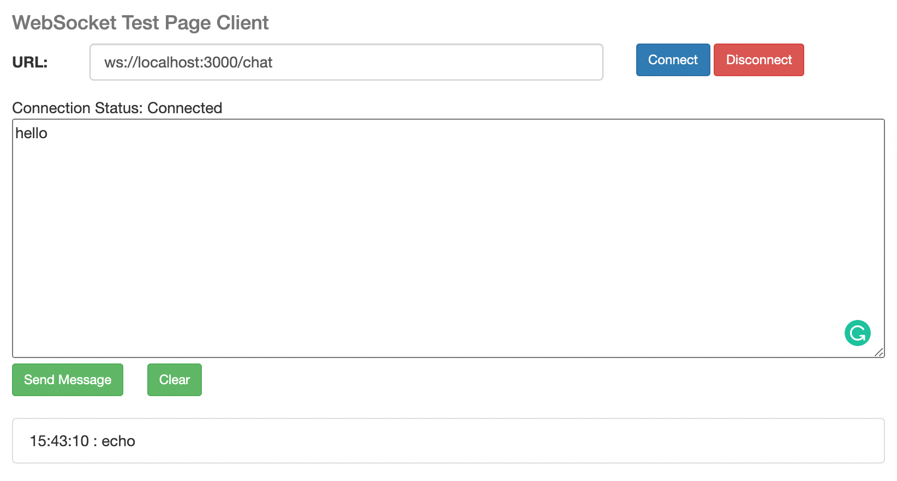
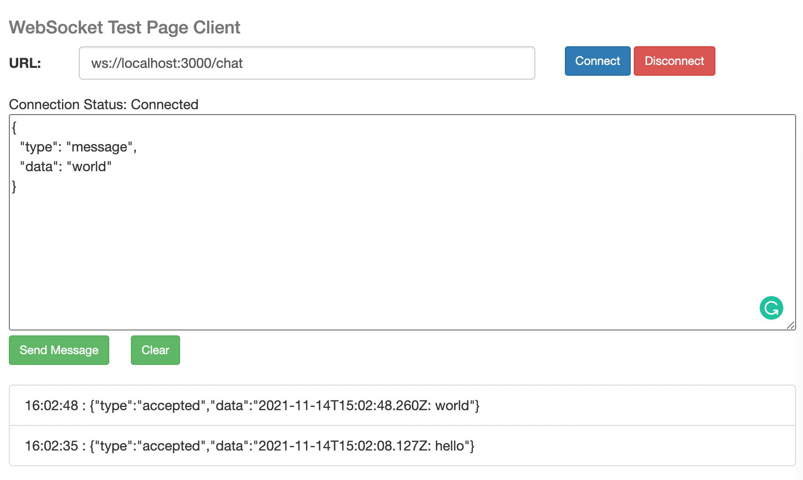
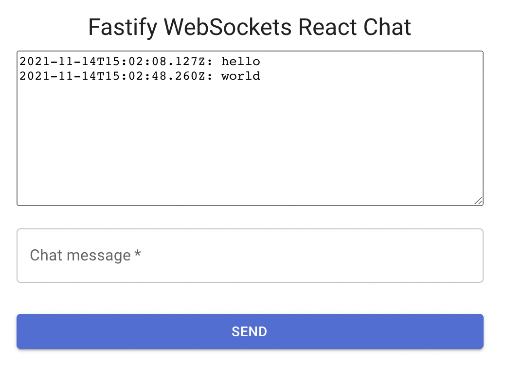

# Fastify WebSocket React Chat

by *[Manuel Spigolon](https://twitter.com/ManuEomm)*

We are going to implement a simple chat application using the [`fastify-websocket`](https://www.npmjs.com/package/fastify-websocket) plugin and React.js!
You will learn the basics of web sockets.
I will provide you with the React.js code for the frontend, but it will not be our primary focus.

This application will be the baseline for future advanced blog posts about this topic.

## Setup

Let's start by installing the required dependencies.

```sh
mkdir fastify-websocket-chat
cd fastify-websocket-chat
npm init --yes
npm install fastify fastify-websocket fastify-cli
touch app.js
```

We will recreate the same application structure discussed in this [previous blog post](https://backend.cafe/how-to-use-fastify-and-mongodb).

So the `app.js` file will be our application entry point:

```js
module.exports = function plugin (app, opts, next) { next() }
```

The `fastify-cli` plugin will run it for us thanks to the `package.json` `scripts` configuration:

```json
{
   "start": "fastify start -l info app.js",
   "dev": "fastify start -l info app.js --watch --pretty-logs",
}
```

Now we can verify that the application is running by executing the `npm start` command.

## Web Sockets

It is time to implement the chat application.
Let's add the `fastify-websocket` plugin to the `app.js` file:

```js
module.exports = function plugin (app, opts, next) {
  // register the plugin
  app.register(require('fastify-websocket'), {
    clientTracking: true // enable client tracking
  })

  app.get('/chat',
    { websocket: true },
    (connection) => {
      // manage the connection
      const { socket } = connection

      // send a message to the client as response
      socket.on('message', function (message) {
        app.log.info(`Received message: ${message}`)
        socket.send('echo')
      })
  })
  
  next()
}
```

Now, we can use this simple [web applicatio](http://livepersoninc.github.io/ws-test-page/) to test our web socket server:



Great! It seems so simple thanks to the [`fastify-websocket`](https://www.npmjs.com/package/fastify-websocket) plugin that manage the errors and the connection closing automatically for us.

We are now ready to implement the chat application.
We need to define:

- A communication standard for the messages
- Broadcast the messages to all the clients
- The frontend interface to communicate with the server

### How to communicate with the server

Defining the payload format is a crucial part of the success of Web Sockets communication.
You can use low-level such as MQTT over WebSocket, but we will use a simple JSON format for learning purposes.

The payload envelope will be:

```json
{
  "type": "<action>",
  "data": <any payload based on the action>
}
```

### Broadcasting the messages

To broadcast the messages to all the clients, we need to use the `send` method of the socket:

```js
  const history = []
  socket.on('message', function (message) {
    try {
      // let's parse the message
      const json = JSON.parse(message.toString())

      // based on the type of the message, we will do something
      switch (json.type) {
        case 'message':
          {
            // create a valid message as response
            const messageEvent = JSON.stringify({
              type: 'accepted',
              data: `${new Date().toISOString()}: ${json.data}`
            })

            // broadcast to all clients the new message received
            const server = app.websocketServer
            app.log.info('broadcasting to all clients', server.clients.size)
            for (const client of server.clients) {
              client.send(messageEvent)
            }
          }
          break

        default:
          // unknown message type
          socket.send(JSON.stringify({ type: 'reject', data: 'wrong type' }))
          break
      }
    } catch (error) {
      // handle the error
      socket.send(JSON.stringify({ type: 'error', data: error.message }))
    }
  })
```

Now, opening multiple browser's tabs will create multiple clients, and you will be able to see the messages broadcasted by the server to every tab.



### The frontend interface

To add the frontend interface, we will use React.js.
We are going to build a basic chat application for development purposes.

The first step is to create a Fastify route that will serve the React application.
So we can add the route to the `app.js` file:

```js
  app.get('/', async (request, reply) => {
    reply.type('text/html')
    return require('fs/promises').readFile(path.join(__dirname, 'pages/chat.html'))
  })
```

The `chat.html` must be created, and it will contain the React application.

The key part of the React application is the `<WsConnection />` component.
It manages the `WebSocket` connection and the messages received.

You can see the code in the [`pages/chat.html`](https://github.com/Eomm/fastify-websocket-chat) file.
It is an application implemented into a single HTML page to ease the reading of the code.

The file structure is:

- the `<script />` imports using the CDN URLs
- the `<WsConnection />` component
- the `<App />` component
- the rendering of the `<App />` component using the Material-UI theme

The `<WsConnection />` interface will be like this:

```jsx
<WsConnection
  url="ws://localhost:3000/chat"
  onOpen={() => setConnecting(false)}
  onChannelOpened={(inChannel) => { setChannel(() => { return inChannel }) }}
  onMessage={({data}) => setMessages((prevState) => { return [...prevState, data] })}
  onClose={() => { setConnecting(true); setStatus('Disconnected') }}
  onError={(error) => { setConnecting(true); setStatus(error.message) }}
/>
```

The UI will update automatically when a new message is received or the connection status change:



The `inChannel` property is a function that other components can use to submit messages to the server.
It is set only when the connection is open.

Well done!
Now you know how to start tweaking the application and implement new features like:

- message history
- add new fields to the message payload, such as the user name
- add a new action to the payload such as `joined` or `left` for those users that join or leave the chat

Spoiler, in future blog posts, we will implement these features, and we will deploy this application too!
To get notified when they are ready to subscribe to the [Backend Café](https://backend.cafe/) newsletter!

### Acknowledgements

Thanks to [Andrea Tosatto](https://github.com/andtos90) for the review of the code!

Happy coding!
